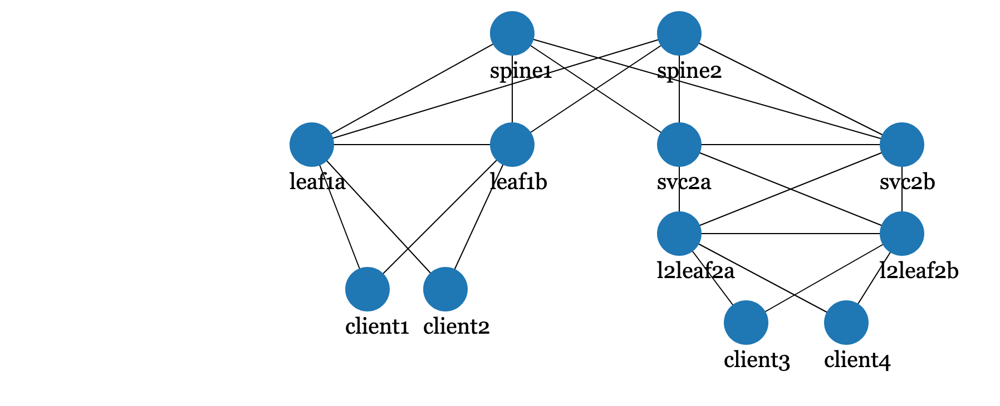
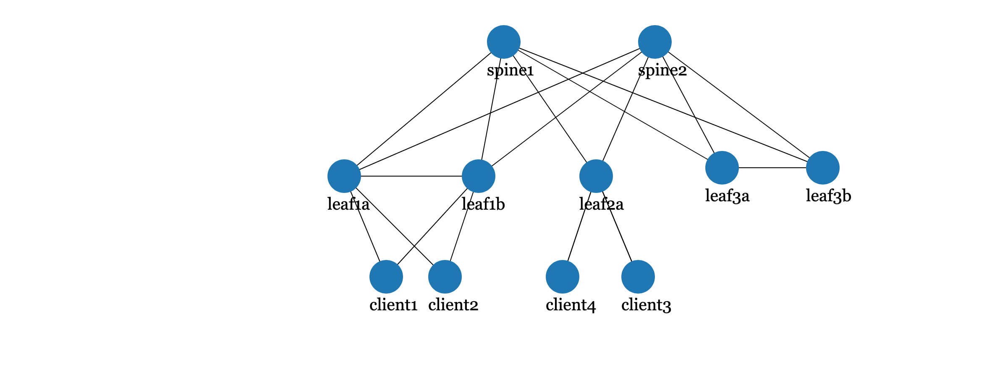

# Arista Validated design with cEOS-lab

- [Overview](#overview)
- [Installation](#installation)
    - [Requirements](#requirements)
    - [Installing Arista cEOS-Lab image](#installing-arista-ceos-lab-image)
    - [Installing the alpine-host image](#installing-the-alpine-host-image)
    - [cEOS containerlab template](#ceos-containerlab-template)
    - [AWS AMI](#aws-ami)
- [Labs](#labs)
- [Demo](#demo)
- [Improvements](#improvements)
  - [Alpine-host configuration](#alpine-host-configuration)
    - [Bonding Configuration](#bonding-configuration)
    - [L3 configuration](#l3-configuration)

## Overview

This repository contains ansible playbooks which allow the user to quickly:

1. Deploy cEOS-Lab Leaf Spine topology using [containerlab](https://containerlab.srlinux.dev/).
2. Configure the Leaf Spine Fabric using Arista Ansible [AVD](https://avd.sh/en/latest/index.html)

The same AVD templates can also be used with vEOS-Lab and physical Lab switces with slight changes to management IP and VRF.

## Installation

Clone the repository and ensure to have the required libraries and software installed.

### Requirements

- Python 3.6.8 or above
- ansible 2.10.0 or above
- arista.avd ansible collection (latest)
- containerlab=0.14.4 (last supported release [`v1.1.2`](https://github.com/arista-netdevops-community/avd-cEOS-Lab/releases))
- containerlab=0.15 ( release [`v2.0.0`](https://github.com/arista-netdevops-community/avd-cEOS-Lab/releases) and above )
- arista.avd requirements
- docker
- Arista cEOS-Lab image
- Alpine-host image
- Replace default cEOS container template

For arista.avd installation please refer to the [official](https://avd.sh/en/latest/docs/installation/requirements.html) documenation.

For containerlab installation please refer to the [official](https://containerlab.srlinux.dev/install/) documentation.

For Python3, docker and ansible installation please refer to the installation guides based on the host OS.

**NOTE** :warning: Containerlab topology definitions have changed starting v0.15 - [`Release Notes`](https://containerlab.srlinux.dev/rn/0.15/). Latest release of this repository is containerlab v0.15 compatible. For older containerlab compatible syntax download [`v1.1.2`](https://github.com/arista-netdevops-community/avd-cEOS-Lab/releases)

### Installing Arista cEOS-Lab image

Download the image from www.arista.com > Software Downloads > cEOS-Lab > EOS-4.2x.y > cEOS-lab-4.2x.y.tar.xz

To import the image, ensure docker service is already up and running on the host.

```shell
docker version
```

Next use the tar file to import the cEOS-Lab image using the following command:

```shell
docker import cEOS64-lab-4.26.1F.tar.xz ceosimage:4.26.1F

docker images | egrep "REPO|ceos"
REPOSITORY            TAG                 IMAGE ID            CREATED             SIZE
ceosimage             4.26.1F             41b309a15f5c        30 hours ago        1.71GB
```

### Installing the alpine-host image

Build the alpine-host image using the modified Dockerfile from [docker-topo](https://github.com/networkop/docker-topo/tree/master/topo-extra-files/host) 

```shell
├── alpine_host
   ├── Dockerfile
   ├── README.md
   ├── build.sh
   └── entrypoint.sh
```

Run the `build.sh` script

```shell
./build.sh
```

Verify the alpine-host image is created:

```shell
docker images | egrep "TAG|alpine"
REPOSITORY            TAG                 IMAGE ID            CREATED             SIZE
alpine-host           latest              eab21450c58c        30 hours ago        68.7MB
```

Alternatively you can use cEOS container as a host, or any other linux based container for host simulation.

### cEOS containerlab template

**NOTE** :warning: This is no longer required starting containerlab v0.15. The v2.0.0 and above releases of this repository includes this template in the `topology.yaml` itself.

Replace the containerlab cEOS default template with the `ceos.cfg.tpl` file from this repository.

```shell
ceos_lab_template
└── ceos.cfg.tpl
```

The default template can be found at `/etc/containerlab/templates/arista/ceos.cfg.tpl`

This is to ensure the containers by default come up with:

1. Multi agent routing model
2. MGMT vrf for management connectivity
3. eAPI enabled

**NOTE** For containerlab version less than v0.15, If the default template is not replaced with the one from this repository, then for the intial AVD config replace you will observe a timeout error.

## AWS AMI

Following AWS AMI with all requirements installed. Built by Michael Pergament.

- Region: public, eu-central-1
- AMI Name: ceos-avd-containerlab
- AMI ID: ami-074255c4c2a49c019
- Credentials (username/password): ubuntu/Lt29*67hnzRh

## Labs

Currently following labs are available

1. EVPN Symmetric IRB (eBGP Overlay and eBGP Underlay) (2 Spine + 2 MLAG Leaf Pair + 2 L2 leaf + 4 Clients) [`labs/evpn/avd_sym_irb/`]



2. EVPN Symmetric IRB (iBGP Overlay and OSFP Underlay) (2 Spine + 2 MLAG Leaf Pair + 4 Clients) [`labs/evpn/avd_sym_irb_ibgp`]


3. EVPN Asymmetric IRB ( eBGP Overlay and eBGP Underlay ) (2 Spine + 2 MLAG Leaf Pair + 4 Clients) [`labs/evpn/avd_asym_irb`]


4 EVPN Centralized Anycast Gateway ( eBGP Overlay and eBGP Underlay ) ( 2 spine + 1 MLAG Compute leaf pair + 1 MLAG Service Leaf pair + 4 Clients ) [`labs/evpn/avd_central_any_gw`]



3. More labs in progress

## Demo

This Demo will deploy Lab (1) using containerlab and configure the Fabric using AVD.

***NOTE*** The cEOS container IP's are hardcoded in the 172.100.100.0/24 subnet. If you are seeing clashes with existing docker container network, then change the management IPs in the following files:

1. `topology.yaml`
2. `DC1_FABRIC.yaml`
3. `inventory.yaml`

```shell
labs/evpn/avd_sym_irb
├── ansible.cfg
├── group_vars
│   ├── AVD_LAB.yaml
│   ├── DC1_FABRIC.yaml
│   ├── DC1_L2_LEAFS.yaml
│   ├── DC1_L3_LEAFS.yaml
│   ├── DC1_SERVERS.yaml
│   ├── DC1_SPINES.yaml
│   └── DC1_TENANTS_NETWORKS.yaml
├── host_l3_config
│   └── l3_build.sh
├── inventory.yaml
├── playbooks
│   └── fabric-deploy-config.yaml
└── topology.yaml
```

Deploy the cEOS-Lab topology using the `labs/evpn/avd_sym_irb/topology.yaml` file.

```shell
containerlab deploy -t topology.yaml
```

To check the topology status use the following command:

```shell
containerlab inspect -t topology.yaml

+----+----------------------+--------------+-------------------+-------+-------+---------+-------------------+------------------------+
| #  |         Name         | Container ID |       Image       | Kind  | Group |  State  |   IPv4 Address    |      IPv6 Address      |
+----+----------------------+--------------+-------------------+-------+-------+---------+-------------------+------------------------+
|  1 | clab-avdirb-client1  | dc0b8645d9af | alpine-host       | linux |       | running | 172.100.100.10/24 | 2001:172:100:100::4/80 |
|  2 | clab-avdirb-client2  | ab9ecaeb905b | alpine-host       | linux |       | running | 172.100.100.11/24 | 2001:172:100:100::b/80 |
|  3 | clab-avdirb-client3  | 65cdbd1f10e8 | alpine-host       | linux |       | running | 172.100.100.12/24 | 2001:172:100:100::8/80 |
|  4 | clab-avdirb-client4  | 2a7ee93e90cc | alpine-host       | linux |       | running | 172.100.100.13/24 | 2001:172:100:100::c/80 |
|  5 | clab-avdirb-l2leaf2a | 028a61b561db | ceosimage:4.26.1F | ceos  |       | running | 172.100.100.8/24  | 2001:172:100:100::9/80 |
|  6 | clab-avdirb-l2leaf2b | 98f35aef0f8a | ceosimage:4.26.1F | ceos  |       | running | 172.100.100.9/24  | 2001:172:100:100::d/80 |
|  7 | clab-avdirb-leaf1a   | 3ff30f990c4d | ceosimage:4.26.1F | ceos  |       | running | 172.100.100.4/24  | 2001:172:100:100::a/80 |
|  8 | clab-avdirb-leaf1b   | fe6f2af30ddb | ceosimage:4.26.1F | ceos  |       | running | 172.100.100.5/24  | 2001:172:100:100::6/80 |
|  9 | clab-avdirb-spine1   | 9b42967c2542 | ceosimage:4.26.1F | ceos  |       | running | 172.100.100.2/24  | 2001:172:100:100::7/80 |
| 10 | clab-avdirb-spine2   | 55480cdb61ef | ceosimage:4.26.1F | ceos  |       | running | 172.100.100.3/24  | 2001:172:100:100::3/80 |
| 11 | clab-avdirb-svc2a    | 99d405f3f4e1 | ceosimage:4.26.1F | ceos  |       | running | 172.100.100.6/24  | 2001:172:100:100::2/80 |
| 12 | clab-avdirb-svc2b    | 3e50c9c24433 | ceosimage:4.26.1F | ceos  |       | running | 172.100.100.7/24  | 2001:172:100:100::5/80 |
+----+----------------------+--------------+-------------------+-------+-------+---------+-------------------+------------------------+
```

***TIP***: For a graphical view of the topology using `containerlab graph -t topology.yaml`

Wait for containers to come up, and login to check the baseline configuration generated using the `ceos.cf.tpl`

```shell
$ ssh admin@172.100.100.4

leaf1a>en
leaf1a#
leaf1a#show ver
 cEOSLab
Hardware version:
Serial number:
Hardware MAC address: 001c.7317.bc7b
System MAC address: 001c.7317.bc7b

Software image version: 4.26.1F-22602519.4261F (engineering build)
Architecture: x86_64
Internal build version: 4.26.1F-22602519.4261F
Internal build ID: 1eca5f74-3ced-441a-9137-c966e8f0319d
Image format version: 01.00

cEOS tools version: 1.1
Kernel version: 4.15.0-117-generic

Uptime: 0 weeks, 0 days, 0 hours and 15 minutes
Total memory: 15392708 kB
Free memory: 2516960 kB
```

Next use the `playbooks/fabric-deploy-config.yaml` to configure the entire fabric

```shell
ansible-playbook playbooks/fabric-deploy-config.yaml
```

Within 1 minute your entire fabric is deployed.

```shell
DC1_SPINE1#show bgp evpn summary
BGP summary information for VRF default
Router identifier 192.168.255.1, local AS number 65001
Neighbor Status Codes: m - Under maintenance
  Description              Neighbor         V  AS           MsgRcvd   MsgSent  InQ OutQ  Up/Down State   PfxRcd PfxAcc
  DC1_LEAF1A               192.168.255.3    4 65101             35        36    0    0 00:01:34 Estab   7      7
  DC1_LEAF1B               192.168.255.4    4 65101             33        37    0    0 00:01:30 Estab   7      7
  DC1_SVC2A                192.168.255.5    4 65102             36        36    0    0 00:01:30 Estab   7      7
  DC1_SVC2B                192.168.255.6    4 65102             32        37    0    0 00:01:30 Estab   7      7

DC1_SPINE1#show ip bgp summary
BGP summary information for VRF default
Router identifier 192.168.255.1, local AS number 65001
Neighbor Status Codes: m - Under maintenance
  Description              Neighbor         V  AS           MsgRcvd   MsgSent  InQ OutQ  Up/Down State   PfxRcd PfxAcc
  DC1_LEAF1A_Ethernet1     172.31.255.1     4 65101              8        10    0    0 00:01:41 Estab   3      3
  DC1_LEAF1B_Ethernet1     172.31.255.5     4 65101              9         9    0    0 00:01:35 Estab   3      3
  DC1_SVC2A_Ethernet1      172.31.255.9     4 65102              8         9    0    0 00:01:35 Estab   3      3
  DC1_SVC2B_Ethernet1      172.31.255.13    4 65102              9        10    0    0 00:01:35 Estab   3      3

DC1_LEAF1B#show interfaces vxlan 1
Vxlan1 is up, line protocol is up (connected)
  Hardware is Vxlan
  Source interface is Loopback1 and is active with 192.168.254.3
  Replication/Flood Mode is headend with Flood List Source: EVPN
  Remote MAC learning via EVPN
  VNI mapping to VLANs
  Static VLAN to VNI mapping is
    [110, 10110]      [111, 10111]
  Dynamic VLAN to VNI mapping for 'evpn' is
    [1197, 10]
  Note: All Dynamic VLANs used by VCS are internal VLANs.
        Use 'show vxlan vni' for details.
  Static VRF to VNI mapping is
   [Tenant_A_OP_Zone, 10]
  MLAG Shared Router MAC is 021c.7313.b344
```

## Improvements

### Alpine-host configuration

#### Bonding Configuration

Supported bonding modes are:

- lacp
- static
- none (default)

The teaming mode needs to be specified in the containerlab `topology.yml` file when deploying the fabric.

Example:

```shell
    client1:
      kind: linux
      image: alpine-host
      mgmt_ipv4: 172.100.100.10
      env:
        TMODE: lacp
    client2:
      kind: linux
      image: alpine-host
      mgmt_ipv4: 172.100.100.11
      env:
        TMODE: static
```

#### L3 configuration

Currently L3 configuration can be done either:

- Using the `labs/evpn/avd_<lab>/host_l3_config/l3_build.sh`. The shell script contains the command to configure the VLAN, IP address, Gateway route on the alpine hosts.
  - If VLAN/SVIs (on the switch) are different from default templates please edit the `l3_build.sh` accordingly.
  - If the container names are different please edit the same in `l3_build.sh`

- Manually using the following steps:

```shell

# Login to the container
$ docker exec -it clab-avdirb-client1 /bin/sh

# configure IP and VLAN
/ $ sudo vconfig add team0 110
/ $ sudo ifconfig team0.110 10.1.10.11 netmask 255.255.255.0
/ $ sudo ip link set team0.110 up

# Add route pointing to GW on the leaf switch
/ $ sudo ip route add 10.1.0.0/16 via 10.1.10.1 dev team0.110

# ping GW

/ $ route -n
Kernel IP routing table
Destination     Gateway         Genmask         Flags Metric Ref    Use Iface
0.0.0.0         172.100.100.1   0.0.0.0         UG    0      0        0 eth0
10.1.0.0        10.1.10.1       255.255.0.0     UG    0      0        0 team0.110
10.1.10.0       0.0.0.0         255.255.255.0   U     0      0        0 team0.110
172.100.100.0   0.0.0.0         255.255.255.0   U     0      0        0 eth0

/ $ sudo ping -c 2 10.1.10.1
PING 10.1.10.1 (10.1.10.1): 56 data bytes
64 bytes from 10.1.10.1: seq=0 ttl=64 time=20.531 ms
64 bytes from 10.1.10.1: seq=1 ttl=64 time=5.946 ms

--- 10.1.10.1 ping statistics ---
2 packets transmitted, 2 packets received, 0% packet loss
round-trip min/avg/max = 5.946/13.238/20.531 ms

/ $ arp -a
? (10.1.10.1) at 00:00:00:00:00:01 [ether]  on team0.110
```
