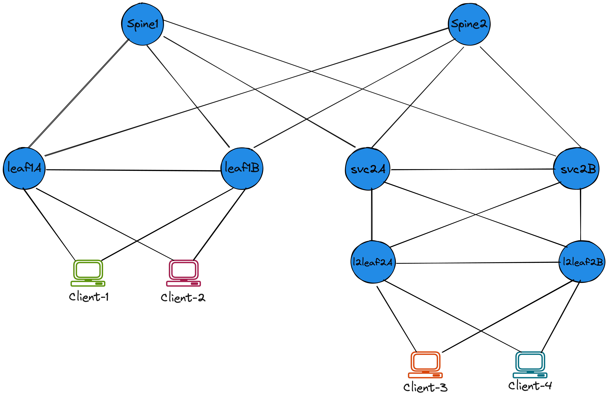
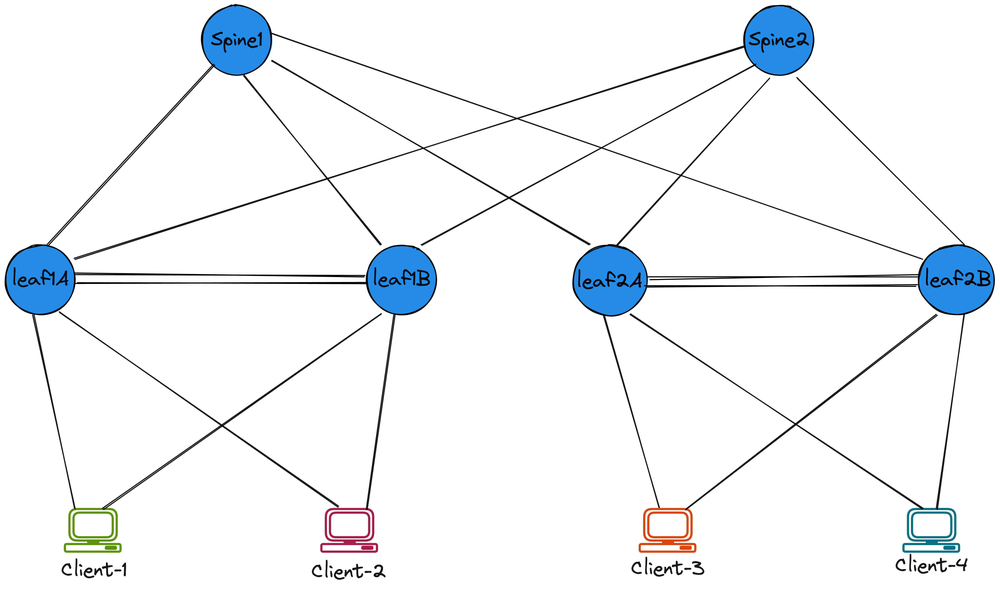
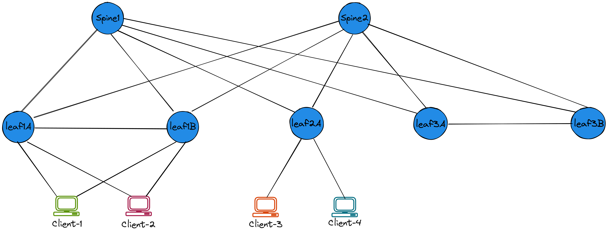
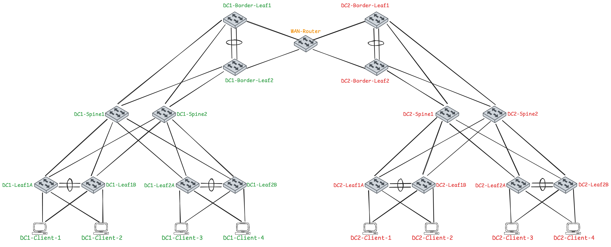
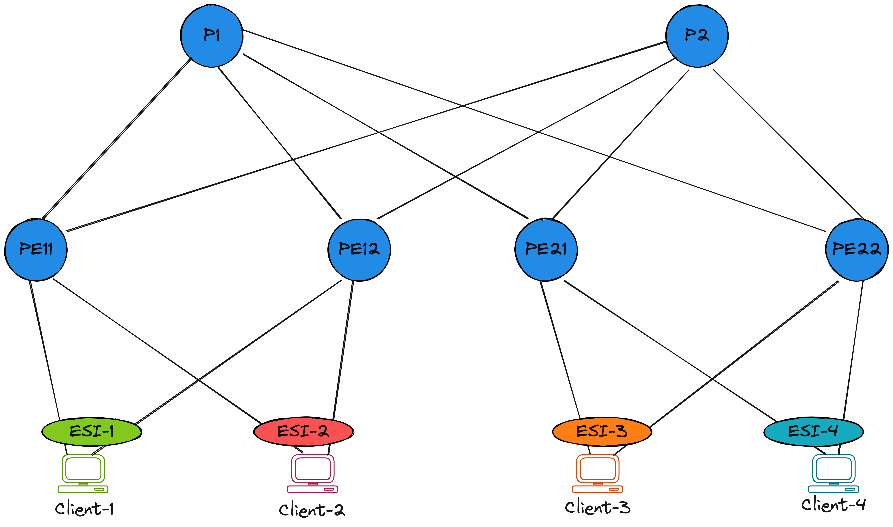

# Arista Validated Designs with cEOS-lab

---

This repository contains labs with examples to quickly deploy:

* Arista cEOS-Lab (*virtual*) based Leaf Spine topology using [containerlab](https://containerlab.dev/).
* Configure the Leaf Spine topology using [Arista Validated Designs (AVD)](https://avd.arista.com/) role.

---

The repository currently contains the following prebuilt labs.

??? example "EVPN Symmetric IRB"
    eBGP Overlay and eBGP Underlay

    2 Spines + 2 MLAG Leaf Pairs + 2 L2 leafs + 4 Clients

    

??? example "EVPN Symmetric IRB"
    iBGP Overlay and OSFP Underlay

    2 Spines + 2 MLAG Leaf Pairs + 4 Clients

    

??? example "EVPN Asymmetric IRB"
    eBGP Overlay and eBGP Underlay

    2 Spines + 2 MLAG Leaf Pairs + 4 Clients

    

??? example "EVPN Centralized Anycast Gateway"
    eBGP Overlay and eBGP Underlay

    2 Spines + 1 MLAG Compute leaf pairs + 1 MLAG Service Leaf pair + 4 Clients

    

??? example "EVPN VXLAN All-active Multi-homing IRB"
    eBGP Overlay and eBGP Underlay

    2 Spines + 4 PEs + 4 Clients

    

??? example "EVPN Single-Active Multihoming Symmetric IRB"
    eBGP Overlay and eBGP Underlay

    2 Spines + 4 PEs + 4 Clients

    

??? example "EVPN VXLAN Dual DC L3 Gateway"
    eBGP Overlay and eBGP Underlay

    2 Spines + 2 MLAG Leaf Pairs + 2 Border Leaves + 4 Clients (per DC)

    

??? example "EVPN VXLAN Dual DC Multi-Domain"
    eBGP Overlay and eBGP Underlay

    2 Spines + 2 MLAG Leaf Pairs + 2 Border Leaves + 4 Clients (per DC)

    

??? example "EVPN MPLS LDP All-Active Multihoming (L2EVPN)"
    iBGP Overlay and MPLS Underlay

    2 Ps + 4 PEs + 4 Clients

    {==using eos_cli_config_gen==}

    

??? example "EVPN All-Active Multihoming IRB with MPLS Underlay"
    iBGP Overlay and MPLS Underlay

    2 Ps + 4 PEs + 4 Clients

    {==using eos_cli_config_gen==}

    
