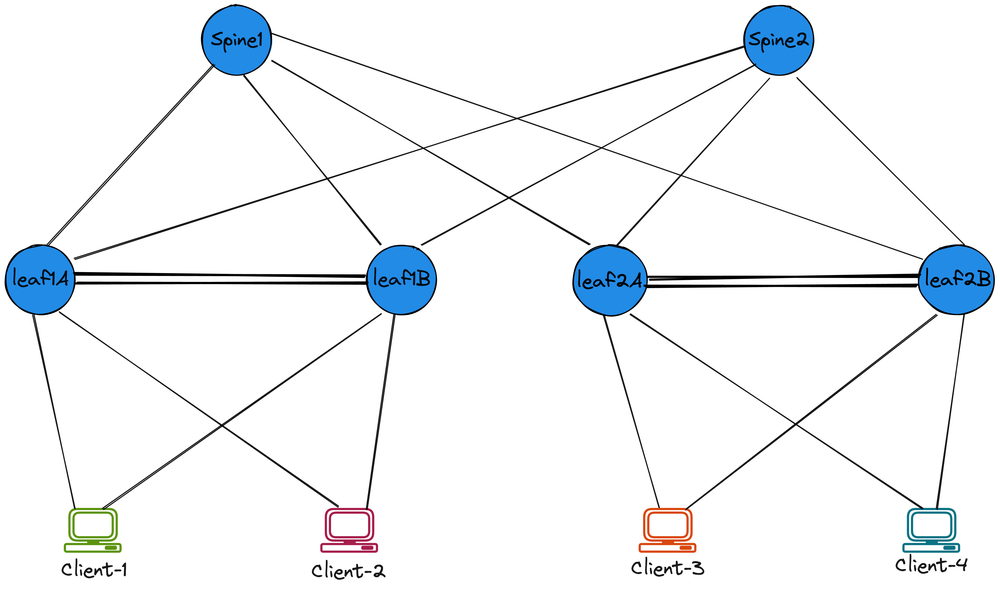

# EVPN Asymmetric IRB

## Lab Overview

|                               |                                                                                  |
| ----------------------------- | -------------------------------------------------------------------------------- |
| **Name**                      | avdasymirb                                                                       |
| **Description**               | eBGP Overlay and eBGP Underlay                                                   |
| **Devices**                   | 2 Spines + 2 MLAG Leaf Pairs + 4 Clients                                         |
| **Lab Directory**             | `avd-cEOS-Lab/labs/evpn/avd_asym_irb`                                            |

??? example "Reveal Topology"
    

## Deploy Lab

* Navigate to the lab directory

```bash
cd avd-cEOS-Lab/labs/evpn/avd_asym_irb
```

* Deploy the cEOS-lab containers

```bash
sudo containerlab deploy -t topology.yaml
```

* Build and deploy the configuration to the switches using eAPI

```bash
ansible-playbook playbooks/fabric-deploy-config.yaml
```

* Configure the alpine-host clients

```bash
bash host_l3_config/l3_build.sh
```

???+ info
    For detailed deployment and validation steps please refer to the commands and example in the Getting Started [guide](../quickStart.md).
