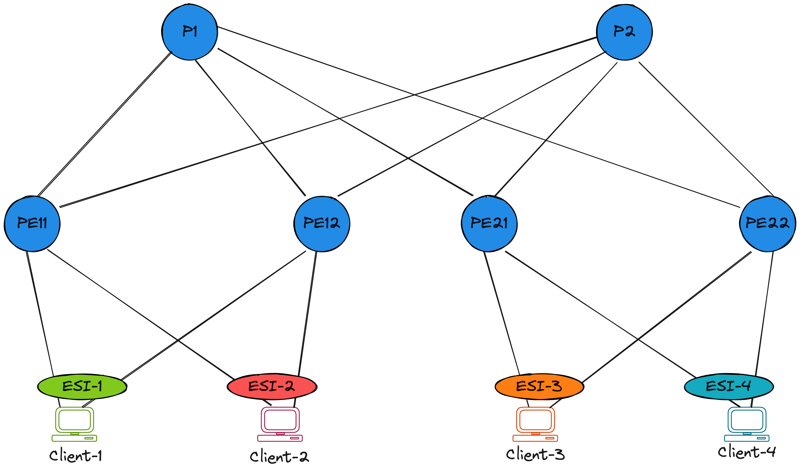

# EVPN MPLS LDP All-Active Multihoming (L2EVPN)

## Lab Overview

|                               |                                                                                  |
| ----------------------------- | -------------------------------------------------------------------------------- |
| **Name**                      | mplsl2evpn                                                                       |
| **Description**               | iBGP Overlay and MPLS Underlay                                                   |
| **Devices**                   | 2 Ps + 4 PEs + 4 Clients                                                         |
| **Lab Directory**             | `avd-cEOS-Lab/labs/mpls_ldp_evpn/mpls_ldp_l2evpn`                                |

??? example "Reveal Topology"
    

??? warning "NOTE"
    This lab does not use `arista.avd.eos_designs`, rather uses `arista.avd.eos_cli_config_gen` to build device configuration from pre-built structured configuration files.

## Deploy Lab

* Navigate to the lab directory

```bash
cd avd-cEOS-Lab/labs/mpls_ldp_evpn/mpls_ldp_l2evpn
```

* Deploy the cEOS-lab containers

```bash
sudo containerlab deploy -t topology.yaml
```

* Build and deploy the configuration to the switches using eAPI

```bash
ansible-playbook playbooks/fabric-deploy-config.yaml
```

* Configure the alpine-host clients

```bash
bash host_l3_config/l3_build.sh
```

???+ info
    For detailed deployment and validation steps please refer to the commands and example in the Getting Started [guide](../quickStart.md).
